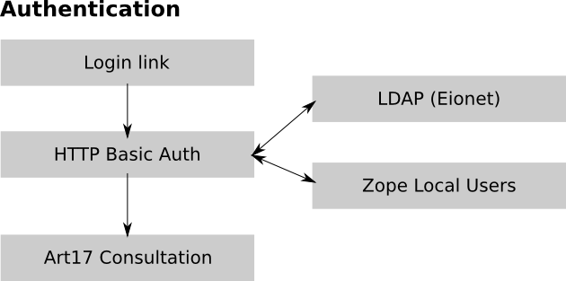

Authentication
==============

The authentication process is done externally, using Zope's builtin HTTP Basic
Authentication mechanism. This page describes the authentication process for
a registered user.

   Authentication Overview

Login Process
-------------

These are the steps explained:

#. The user accesses http://bd.eionet.europa.eu/article17/reports2012/ and clicks on the *Login* link in the top left part of the page.
#. A popup appears asking for credentials
#. The user enters the username and password for bd.eionet.europa.eu (either LDAP or local account)
#. The user is redirected to the home page of the consultation tool, and the *Login* link changes to *Logout (username)*.
