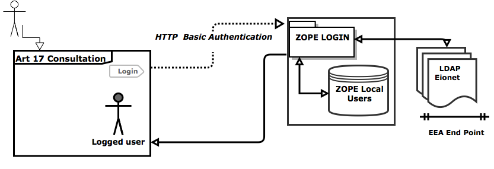

Authentication
==============

The authentication process is done externally, using Zope's builtin
authentication mechanism. This page describes the authentication process for a
registered user.

   Authentication Overview

Backend
-------
The authorization is done using the Zope `/loggedin` view, which validates
the user credentials using either LDAP or local stored accounts. The validation
is made entirely by Zope, independent of the Flask application.

An authenticated session uses HTTP Basic Authentication. This means the browser
sends with every request a HTTP header with the authenticated user credentials.

Login Process
-------------

These are the steps explained:

#. The user accesses http://bd.eionet.europa.eu/article17/reports2012/ and
   clicks on the *Login* link in the top left part of the page.
#. A popup appears asking for credentials
#. The user enters the username and password for bd.eionet.europa.eu (either
   LDAP or local account)
#. The user is redirected to the home page of the consultation tool, and the
   *Login* link changes to *Logout (username)*.

Registration
-------------

By design and software specifications, the consultation is available for
anybody to both view and inspect the Biogeographical assessments. For other
purposes such as editing and actively participating into drawing conclusions,
one has to prior register for the consultation. As stated in the authentication
process there are two ways by which one can do so:

#. with an existing EIONET account (LDAP)
#. with a local user (Zope)

For either one of the account types mentioned above, a new entry in the local
database is created.

The two types of accounts can be achieved by both self-registration and admin
workaround. This process is detailed in the **Art17 Consultation User Manual**,
the **Registration** section.
