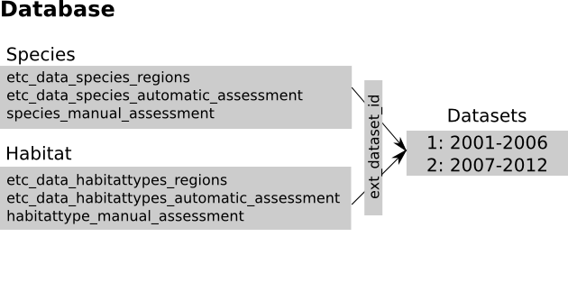

Database
========

This page describes the database structure. We're using the term *Dataset* to
describe a set of data for a given reporting period (such as 2001-2006). We
refer the table structure as *Schema*.

   The Database

Structure
---------
The tables can be classified *by content* in:

#. Initial content tables (ETC/BD member states data - ``*_regions``,
   Automatic Assesments - ``*_automatic_assessments``)
#. Dictionary tables (Country codes, Method details, Trend details, ...
   ``*_dic_*``)
#. User contributed content (Conclusions - ``*_manual_assessments``,
   Comments on conclusions - ``*_comments``, Datasheet info,
   Audit trail - ``*wiki*``)
#. Application specific (Registered Users, Configuration, Dataset information).

Each of the tables in the first three categories contain a column named
`ext_dataset_id` linking to the dataset the record belongs to.

Backend
-------

We're using a single database on a Postgres server running on localhost. Each
table has a corresponding class in ``models``, and the rows in the table are
instances of that class.

Management
----------

The ``manage.py dataset`` command can be used to manage bulk data. Usually, a
dataset is another Postges database on the same machine. The following commands
are available:

* ``dataset ls`` - list all datasets in the application database
* ``dataset rm`` - remove a dataset (and all entries related to that dataset
  in various tables)
* ``dataset import`` - import a new dataset into the application database; a
  new dataset will be created and records from another database will be copied
  and inserted with the new dataset id as *ext_dataset_id* key
* ``dataset update`` - replace values with a given dataset from a list of
  tables with values from correspondent tables in another database
