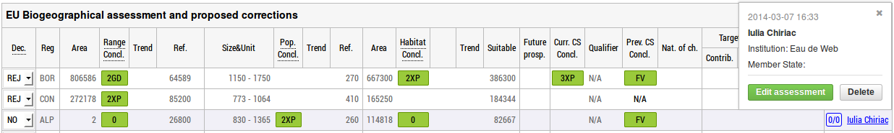

EU Biogeographical assessment and proposed corrections
======================================================

By design and software specifications, the data from Art17 consultation is
available to view, without any form of authentication. However, updating
data is conditioned by prior registration for the consultation.
The two ways by which one can do so are widely described in ... TODO.

The level of access to the application core is spread through different
permissions that are nicely bundled into four different roles:

* Administrator (ADM)
* European topic center (ETC)
* National expert (NAT)
* Stakeholder (STK)

Further details about each role and its capabilities in terms of assessment
operations are to be described within each of the following sections.

Add assessments
---------------

All registered users can propose corrections to the automatic assessments by
adding a manual assessment on the Species/Habitat data summaries page.
The user is allowed to add only one record for each period, subject and region.
In order to add an assessment a bio-region must be selected.

All users add conclusions using roughly the same form, with a few exceptions:

* NAT user can add a conclusion only for his country;
* ETC user can add a conclusion only for EU27;
* STK and ADM have an additional MS selectbox, and can select any Member State.

Edit assessments
----------------

Assessments can be updated by accessing the Edit Assessment (Propose correction
for STA users) button visible after clicking the assessor's name.

All registered users can edit their own assessments; all assessment fields can
be modified.
ETC and ADM users can also edit other user's assessments, but they can only
change favourable reference values.

Delete assessments
------------------

Comment on assessments
----------------------

Change decision
---------------
