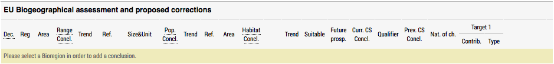
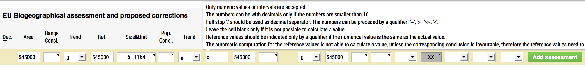
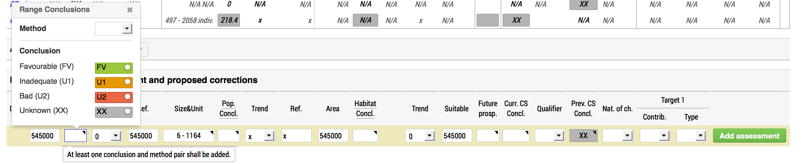
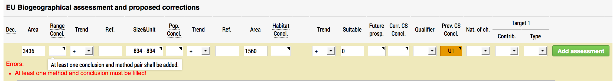

EU Biogeographical assessment and proposed corrections
======================================================

Assessments on the conservation status of the habitat types and species of
Community interest have been carried out in EU25 for the period 2001-2006 and
in EU 27 for the period 2007-2012, compiled as part of the Habitats Directive -
Article 17 reporting process. The data summary sheet for species and habitat
conservation status provides an overview per biogeographical region.

By design and software specifications, the data is available to view,
without any form of authentication. However, updating data is
conditioned by prior registration for the consultation.
The two ways by which one can do so are widely described in ... TODO.

The level of access to the application core is spread through different
permissions that are nicely bundled into three different roles:

* European topic center (ETC)
* National expert (NAT)
* Stakeholder (STK)

Further details about each role and its capabilities in terms of assessment
operations are to be described within each of the following sections.

Add assessments
---------------

All registered users can propose corrections to the automatic assessments by
adding a manual assessment on each of the Species/Habitat data summaries pages.
The user is allowed to add **only one** record for each period, subject and region.
As the next figure depicts, in order to add an assessment a bio-region **must
be** selected.

Adding a proposed correction to the automatic assessment is straightforward.
A long horizontal table sized form, measuring all corresponding table columns
lies at the bottom of the table, marked as `EU Biogeographical assessment and
proposed corrections` section. The input values that can be added are bounded
to the same range as the already registered ones. However, for a better
understanding and an improved usability, each form field reveals clarifications
and constraints along with more information about that specific cell. The next
figure depicts a sample of the shown tooltip when the mouse is hover in the
`Population -> Reference` cell. Please do keep in mind that all cells in this
form reveal such a tooltip.

As the range values for each form field content are specified in the above mentioned
tooltips, there is also a logic requirement when adding corrections. That is, at
least one pair of `method-conclusion` must be added of all the possible
conclusions: range, population, habitat, future prospects and overall
assessments. The next two figures depict the way this required logic is
presented along with the situation in which the corresponding validating errors
are raised.

All users add conclusions using roughly the same form, with a few exceptions:

* NAT user can add a conclusion only for his country;
* ETC user can add a conclusion only for EU27;
* STK and ADM have an additional MS selectbox, and can select any Member State.

Edit assessments
----------------

Assessments can be updated by accessing the Edit Assessment (Propose correction
for STA users) button visible after clicking the assessor's name.

.. figure:: images/edit_assmt_btn.png

All registered users can edit their own assessments; all assessment fields can
be modified.
ETC and ADM users can also edit other user's assessments, but they can only
change favourable reference values.

Delete assessments
------------------

Comment on assessments
----------------------

Change decision
---------------
