EU Biogeographical assessment and proposed corrections
======================================================

Assessments on the conservation status of the habitat types and species of
Community interest have been carried out in EU25 for the period 2001-2006 and
in EU 27 for the period 2007-2012, compiled as part of the Habitats Directive -
Article 17 reporting process. The data summary sheet for species and habitat
conservation status provides an overview per biogeographical region.

By design and software specifications, the data is available to view,
without any form of authentication. However, updating data is
conditioned by prior registration for the consultation.
The two ways by which one can do so are widely described in ... TODO.

The level of access to the application core is spread through different
permissions that are nicely bundled into three different roles:

* European topic center (ETC)
* National expert (NAT)
* Stakeholder (STK)

Further details about each role and its capabilities in terms of assessment
operations are to be described within each of the following sections.

Add assessments
---------------

All registered users can propose corrections to the automatic assessments by
adding a manual assessment on each of the Species/Habitat data summaries pages.
The user is allowed to add **only one** record for each period, subject and
region. As the next figure depicts, in order to add an assessment a bio-region
**must be** selected.

.. figure:: images/please_select_a_bioregion.png
   :alt: "Please select a bioregion" warning message
   :width: 100%

   "Please select a bioregion" warning message

Adding a proposed correction to the automatic assessment is straightforward.
A long horizontal table sized form, measuring all corresponding table columns
lies at the bottom of the table, marked as `EU Biogeographical assessment and
proposed corrections` section. The input values that can be added are bounded
to the same range as the already registered ones. However, for a better
understanding and an improved usability, each form field reveals clarifications
and constraints along with more information about that specific cell. The next
figure depicts a sample of the shown tooltip when the mouse is hover in the
`Population -> Reference` cell. Please do keep in mind that all cells in this
form reveal such a tooltip.

.. figure:: images/reference_tooltip.png
   :alt: Reference tooltip
   :width: 100%

   Reference tooltip

As the range values for each form field content are specified in the above
mentioned tooltips, there is also a logic requirement when adding corrections.
That is, at least one pair of `method-conclusion` must be added of all the
possible conclusions: range, population, habitat, future prospects and overall
assessments. The next two figures depict the way this required logic is
presented along with the situation in which the corresponding validating errors
are raised.

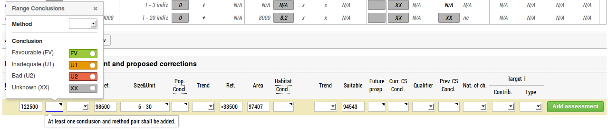

   Method/conclusion tooltip

.. figure:: images/at_least_method_conclusion_error.png
   :alt: Method/conclusion error message
   :width: 100%

   Method/conclusion error message

As previously stated, the level of access to the application core is spread through different
permissions bundled into three different roles. Regardless of the role granted,
the form to propose assessments is roughly the same, with very few exceptions:

* The National expert (NAT) can add a conclusion only for the represented country
* The European topic center (ETC) can add a conclusion only for a country member that is part of EU27
* Stakeholder (STK) has instead, at the beginning of the form, an additional selectbox with the corresponding country codes previously filled with content for the current `(subject, group, region)` tuple

Regardless of the role granted, a successful assessment added would formaly look the way the next figure depicts.

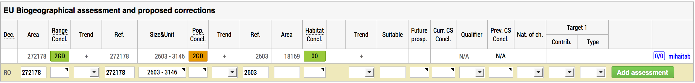

   Successfully add a conclusion

Edit assessments
----------------

Due to admitted human error scope, assessments in the Art17 Consultation platform can be
updated. This is done by accessing the `Edit Assessment` (hence, propose a
correction for that occurence) button, visible after clicking the assessor's name.

.. figure:: images/edit_assmt_btn.png
   :alt: Edit assessment button
   :width: 100%

   Edit assessment button

For simplicity, the protocol states that all registered users can edit their
own assessments; if so, all assessment fields can be modified. Additionaly,
European topic center (ETC) users can also edit other users assessments. For
the latter, please be advised that **only** favourable reference values are
subject to change. The figures below feature the two edit forms.

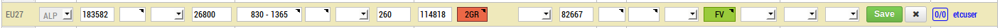

   Edit an assessment added by the current user

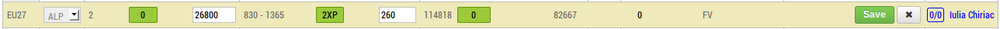

   Edit an assessment added by another user

Delete assessments
------------------

Due to the same human error scope, according to the protocol the Art17
Consultation states, assessments can also be deleted. As a counterpart of
`Edit`, the `Delete` operation is allowed to assessments **authors only**.
This can be achieved by clicking the assessor's name and then the *Delete* button.

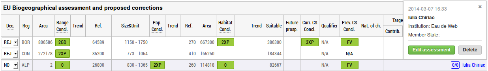

   Delete button for assessments

However, even after being deleted, an assessment continues to be shown in the
`EU Biogeographical assessment and proposed corrections` section so that
other users are notified upon the changes and modifications that took place
for the for the current `(subject, group, region)` tuple. Deleted assessments
are easily distinguished by their light pink background.

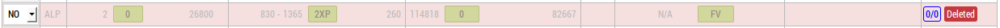

   Deleted assessment

Please note that NAT and STK users can only see each other's deleted assessments
while ETC can overview them all.

Comment on assessments
----------------------

Viewing other users' comments and adding new comments to user proposed
corrections can be done by accessing the *comments* section that each
assessment has. Clicking the rounded rectangle situated on the left of the
assessor's name will open an overlay with the comments for that assessment.

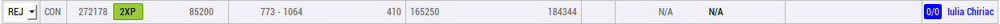

   Assessment comments button

A user can add **only one** comment to an assessment, using the *Add comment*
button.

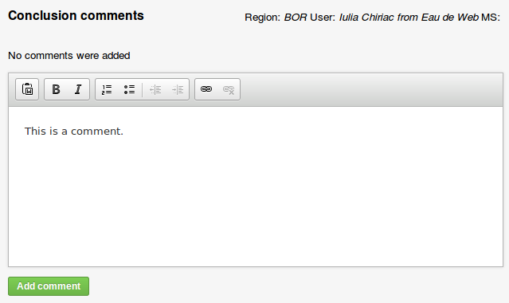

   Add comment button

Afterwards, the user can change, delete or undelete his/her comment; a
deleted comment is still visible to its author and to the users with
**administrator** role.

Other users' comments can be marked as read/unread.

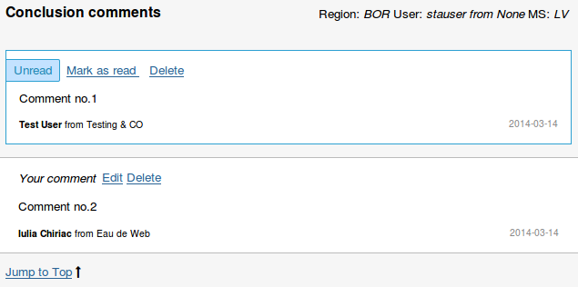

   Actions available for assessment comments (1)

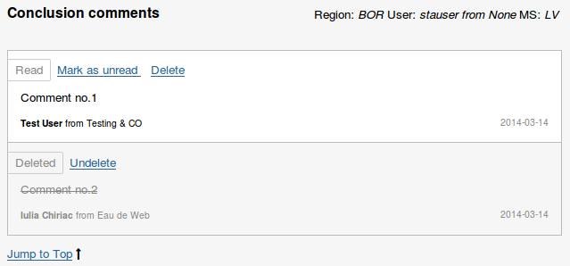

   Actions available for assessment comments (2)

Change decision
---------------

In order to change the decision for an assessment, a user must have **ETC**
role. To change a decision, simply choose an option from the **Decision**
selectbox, as depicted in the figure below.

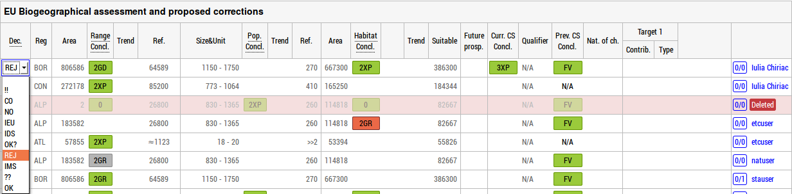

   Decision drop-down list

A successfully updated decision is shown by the fading green background of the
entire assessment row.

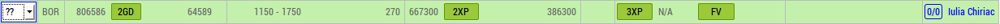

   Successfully changed decision
