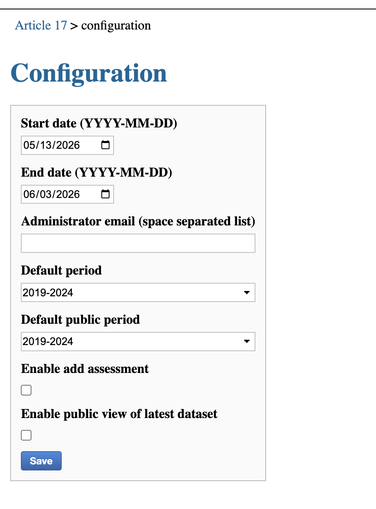
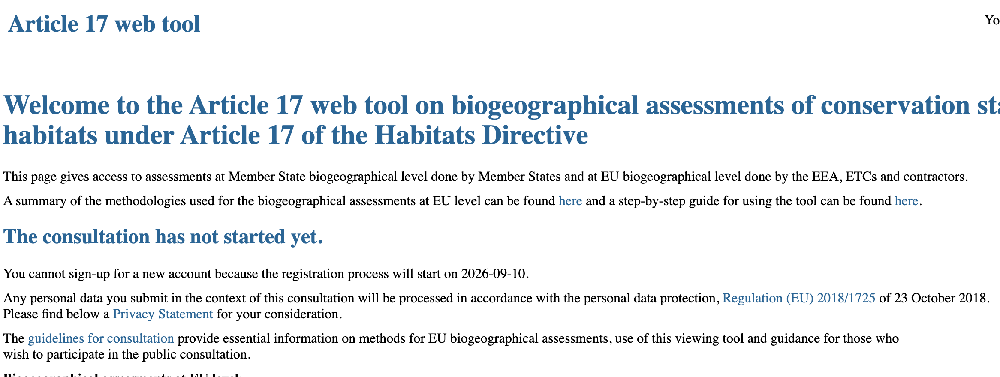
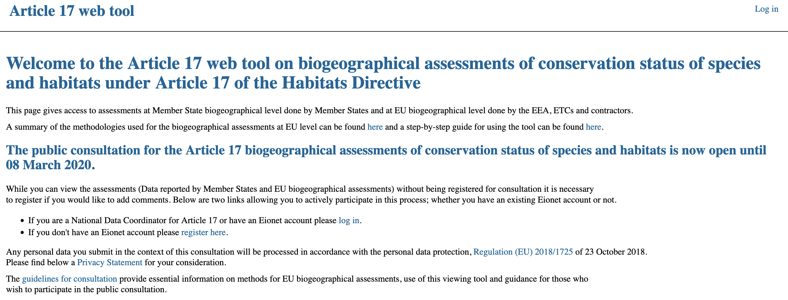
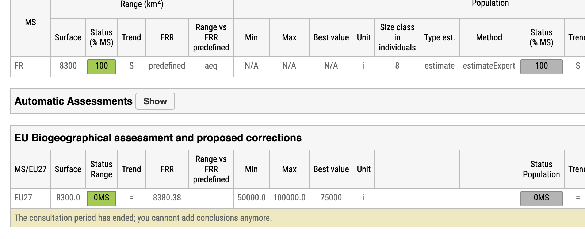

************
Consultation
************

The administrators have access to a Configuration panel for the application.

The user can set the following:

* **Start date** - The day the consultation should start
* **End day** - The day the consultation should end
* **Administrator email** - Administrator emails for notifications
* **Default period** - This should be the latest period (is currently set to 2019-2024)
* **Default public period** - The latest public period. This setting was just added, to allow
    assessors to modify the assessments, but still not display the period 2019-2024 to the public.
    As such, this is set to period 2013-2024.
* **Enable add assessment** - If this is not set, adding assessments will not be possible for anyone, regardless of consultation period or user rights.
* **Enable public view of latest dataset** - Combined with the default public period setting, this enables or disabled the view rights of unauthenticated users.

   *Config panel*

Consultation timeline
---------------------

The set start day and end date have an effect on the application behaviour:

1. **Before the consultation starts (start day is in the future):**

   *Before consultation*

At this point, all previous reporting periods should be marked as read_only (this can only be done in the code right now).
If the new reporting period is available already, the authenticated users will be able to add assessments (if ``Enable add assessment`` is checked.)
Users should not be able to register. As a note, this is not strictly enforced at the moment.

2. **During the consultation (start day is in the past and end date is in the future):**

   *During consultation*

Users should be able to self-register now.

3. **After the consultation ended (end date is in the past):**

   *Stakeholders can no longer add assessments after consultation*

Please note that there is no configured message for the home page when the consultation is over and the during message
needs to be cleared manually by removing the dates.

The stakeholder users are no longer able to add any assessments or edit comments.

Please note that for Assessor users , adding assessments, audit trails and data sheet info is still possible until
the reporting period is marked as read only (which as mentioned above can only be done through the code.)
Please note that NAT users can still add assessments until the reporting period is marked as read only.
