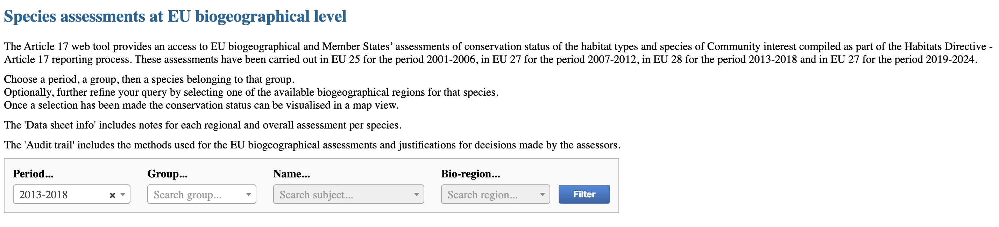
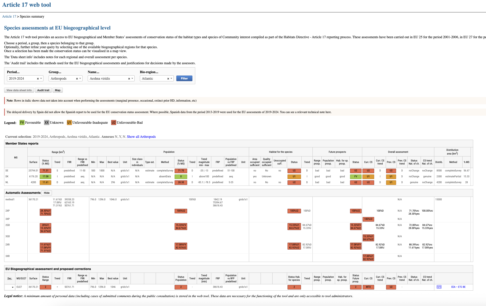
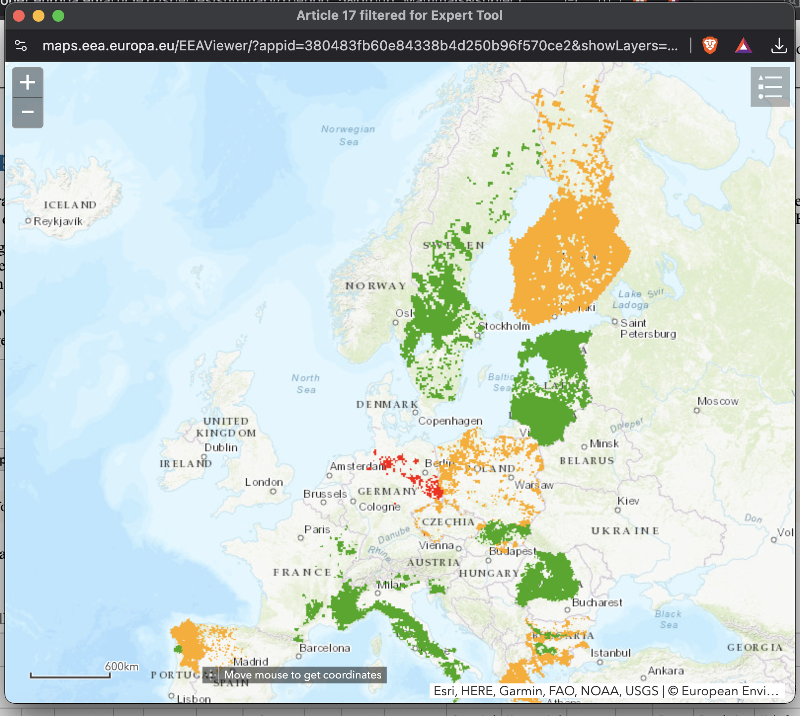
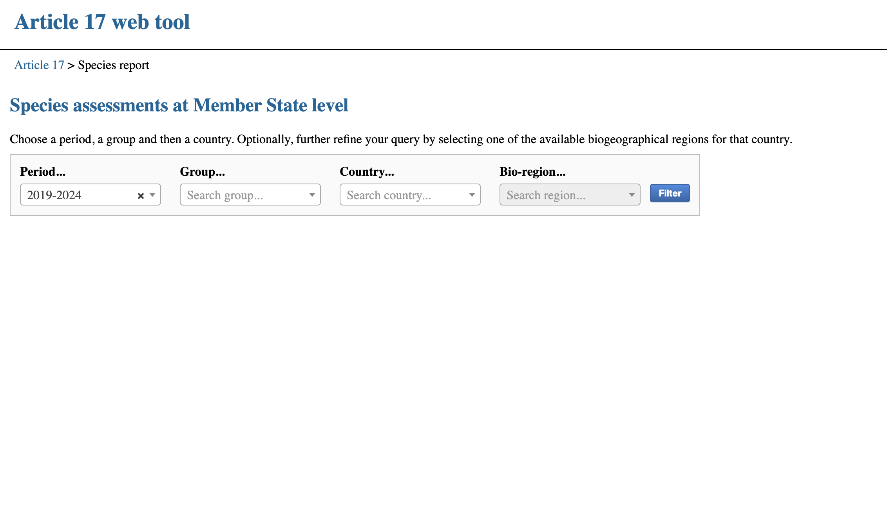
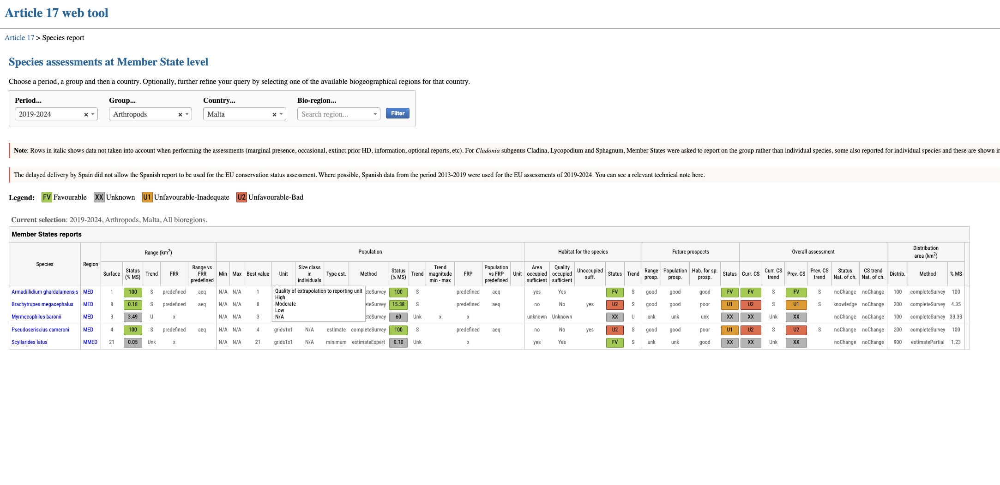
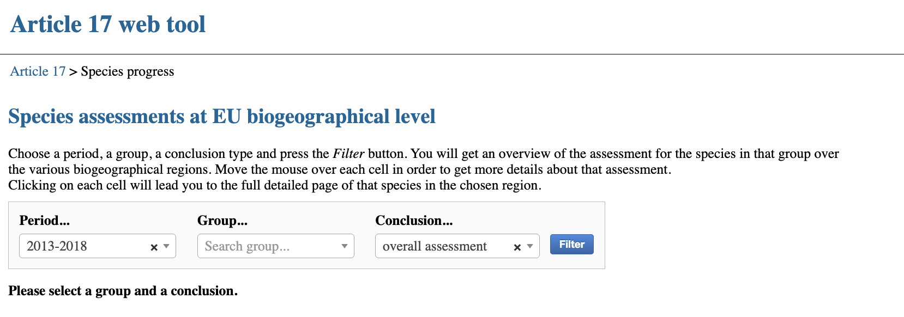
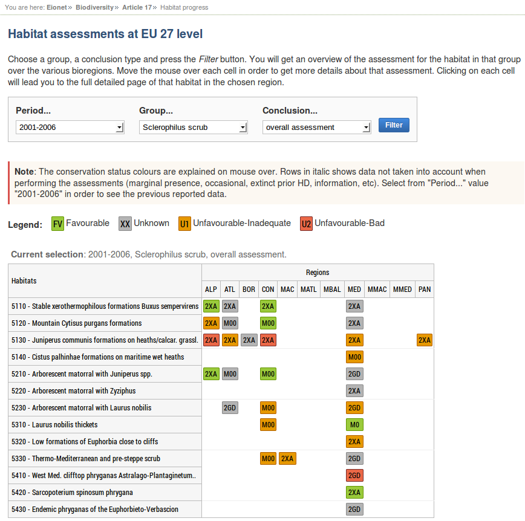
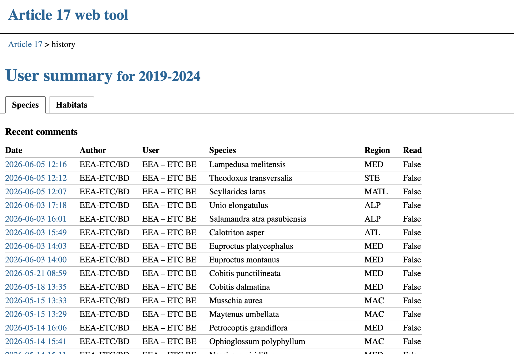
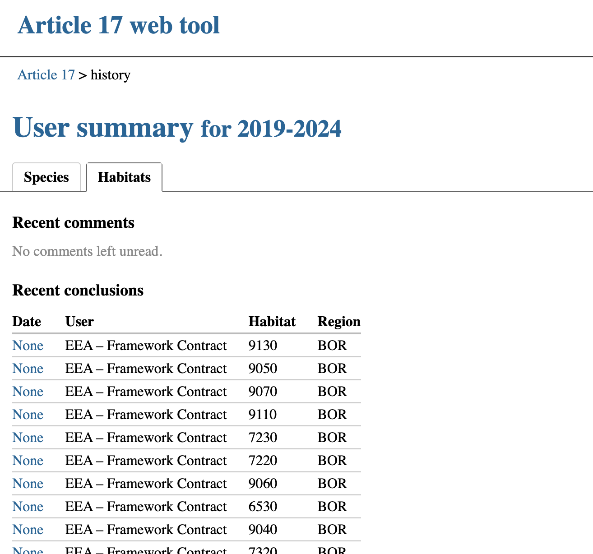

*********
View data
*********

Introduction
============

Anybody is able to view the data as provided by Member States. The latest reporting period data
is only visible to the public (unauthenticated users) if the ``Enable public view of latest dataset``
is checked in ``Config``.

The available data is organized into two periods:

* **2001-2006**, which gathers historical data from the specified period and
  presents it to the user in a readonly mode;
* **2007-2012**, which gathers historical data from the specified period and
  presents it to the user in a readonly mode;
* **2007-2012bis**, which gathers historical data from the specified period and
  presents it to the user in a readonly mode;
* **2013-2018**, which gathers historical data from the specified period and
  presents it to the user in a readonly mode;
* **2019-2024**, the current period, that accepts user corrections and comments.

Biogeographical assessments at EU level
=======================================

The data summary sheet for Species/Habitat conservation status provides an
overview per biogeographical region.

   *Species summary filtering form*

The default period for displaying data is 2019-2024 (but not curently enabled for public view).
It can be changed using the ``Period...`` selectbox.
After choosing a *group*, the ``Name...`` selectbox will be populated with all the
*Species/Habitat type names* belonging to that group. The selection of a
*Species/Habitat type name* is mandatory for filtering, while the selection of a
bio-region is optional.

After pressing the ``Filter`` button a page similar to the one below appears:

   *Species summary page*

The table is made of three main sections:

.. WARNING::
   Those sections might have slightly different names in each reporting period.

* Member States reports
* Automatic Assessments (hidden by default; the user can view information in
  this section by pressing ``Show``)
* EU Biogeographical assessment and proposed corrections

The buttons above the table open corresponding pages in pop-up windows:

.. container:: center

   .. figure:: images/views/buttons.png
      :alt: Species/habitat summary buttons
      :width: 40%

      *Species/habitat summary buttons*

* **View data sheet info** (view/edit data sheet info, add comments)
* **Audit trail** (view/edit audit trail)
* **Map** (show the reports from the countries on a map)
* **Download factsheets** (downloads a PDF file containing a report on the selected species/habitat)

.. WARNING::
   Not all reporting periods have all the buttons available.

   *Map popup window*

Biogeographical assessments at Member State level
=================================================

Species/Habitat assessments
---------------------------

   *Species report filtering form*

This page provides a view similar to the ``Species/Habitat data summaries``,
having the option to refine the query by *country* instead of species/habitat
name.

   *Species report page*

By clicking the *Species/Habitat type name*, a popup window with the original
data is opened. The map view can be accessed through the link on the region
name.

.. WARNING::
   Not all reporting periods  have the original data information linked.

Summary of assessments by group
===============================

Species/Habitat assessments
---------------------------

All the assessments and the progress of EEA, ETCs and contractors work on assessing the
conservation status at biogeographical level, can be seen by following the
*Species/Habitat assessments* link, under the **Summary of assessments by group**
section, that will open the following page:

.. _fig-main:

   *Species progress filtering form*

The default period for displaying data is 2019-2024 (but not curently enabled for public view).
It can be changed using the ``Period...`` selectbox.
By selecting a *group* and a *conclusion type* (``overall assessment``, ``range``, ``future prospects``, etc.)
a view with all the assessments for the Species/Habitat types pertaining to the chosen group and corresponding
biogeographical regions is provided.

.. NOTE::

   Users with administrator role have two additional filtering options: 
      * they can view assessments added by a certain user (using the ``Assessor...`` selectbox)
      * they can switch between a detailed/elementary view (by checking/unchecking the ``Details...`` checkbox)

   .. figure:: images/views/progress_page_admin.png
      :alt: Species progress filtering form
      :align: center
      :width: 90%

      *Species progress filtering form for an administrator user*

Each cell contains a series of information:

* the decision for that assessment
* the method used for the selected conclusion type
* three numbers that show (*visible only for administrator*)
    * unread comments for conclusions introduced by the current user
    * unread comments for all conclusions
    * unread comments for data sheet info

There is also a piece of more detailed information in the cell tooltip (visible at mouseover).
The cell background shows the conclusion of the assessment for the selected
conclusion type and the possible options are presented in the Legend above the
table.

   *Habitat progress page*

By clicking on a cell, the corresponding ``Species/Habitat data summaries`` page
will be opened.

Activity logs
=============

The activity logs page provides to the authenticated user a view with recent
conclusions added by users and recent comments for these conclusions.

   *User activity log for species*

The user can switch between the Species/Habitat view by clicking the desired
tab.

   *User activity log for habitat*

The dates, both for comments and conclusions, are links to the “EU
Biogeographical assessment and proposed corrections” section for the
species/habitat and region selected.

.. NOTE::
   Recently, the species/habitat was moved to serve as the link.
