Data sheet info and Audit trail
===============================

Add/Edit data sheet info
------------------------

If there is no data sheet info record for the period, species/habitat name and
bio-region selected, the authenticated user can add a new data sheet info by
pressing Edit Data Sheet info.

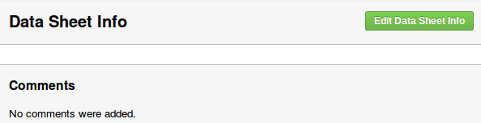

   Add new data sheet info

A rich text editor appears on the page, giving the user the posibility to write
and format the data sheet info text.

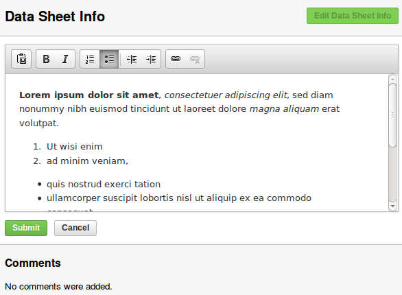

   Add new data sheet info form

After pressing submit, the new data sheet info becomes the active revision.
The operation can be interrupted using the Cancel button.

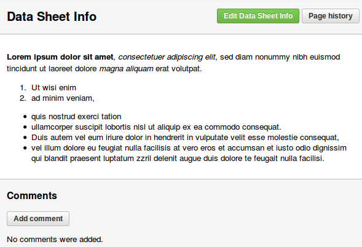

   Active data sheet info

An existing data sheet info record can be modified following the same steps.
Only the active data sheet info can be edited.

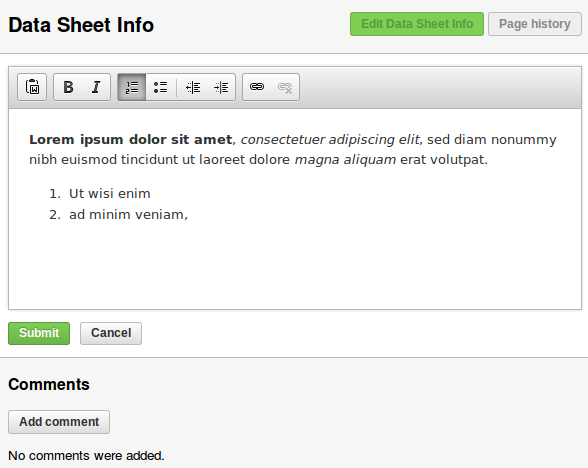

   Edit data sheet info

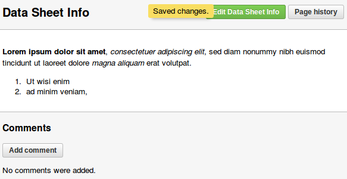

   Updated data sheet info

After successfully submitting the edited data sheet info, it becomes the active
revision. All the revisions can be seen by accessing the Page History.

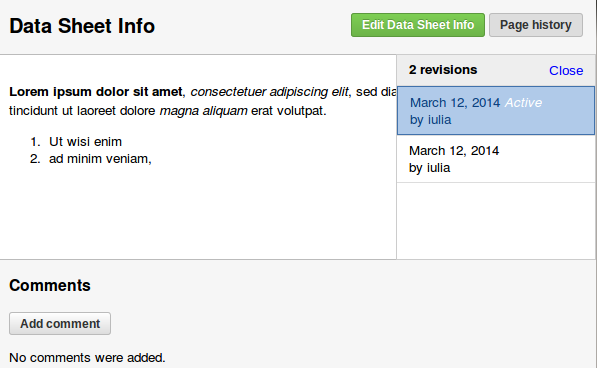

   Page history

Change active revision for data sheet info
------------------------------------------

Clicking the Page history button will open a popover containing a list of all
the data sheet versions for the current selection. Versions other than the
active one can be previewed by clicking the options in the versions list.

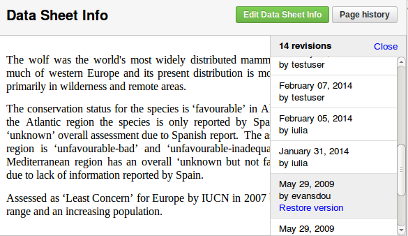

   Preview revision

Following the Restore version link will replace the old active data sheet info
with the one selected from the Page history.

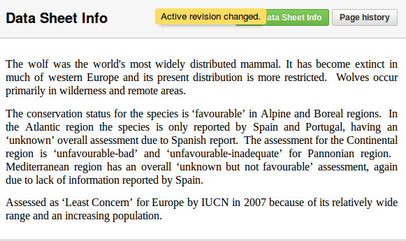

   Change revision

Comment on data sheet info
--------------------------

An authenticated user can add comments to a data sheet info record. The same
restriction as for conclusion comments is imposed: an user can add a single
comment for a selection (period, name, bio-region). Once the comment added, the
user can edit/delete/undelete it.
Comments are added by clicking the Add comment button, that exists on the page
only if a comment hasn't been previously added for that selection.
After filling in the comment textarea, the user is expected to submit the
comment or cancel the operation.

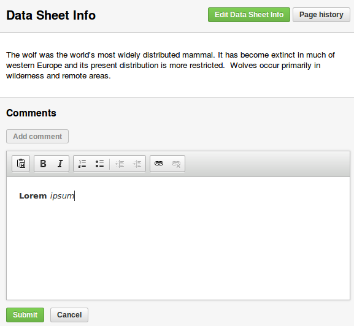

   Add comment

A series of operations are permitted for data sheet info comments:

* owned comments:

    * edit
    * delete
    * undelete

* other users' comments:

    * mark as read
    * mark as unread

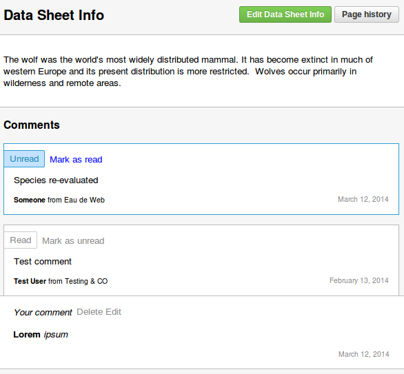

   Manage comments

Add/Edit audit trail
--------------------

An audit trail record can be added only if a bio-region is selected. In a
selection for All bioregions the following warning message will be displayed.

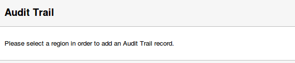

   No region selected warning

When a bio-region is selected, the Edit Audit Trail button is present on the
page.

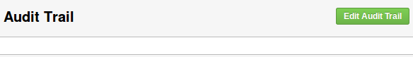

   Add Audit Trail button

Change active revision for audit trail
--------------------------------------
