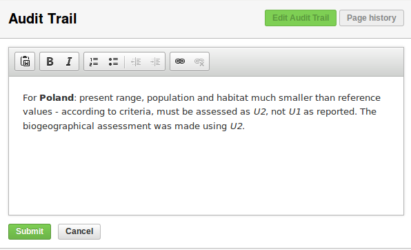
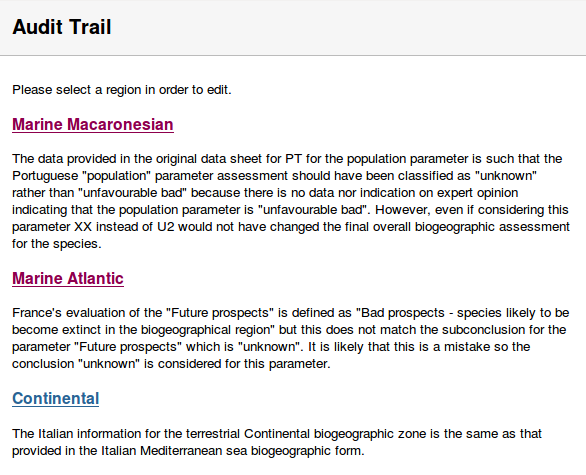
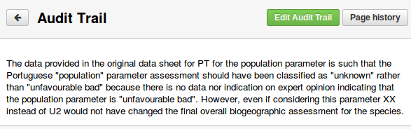
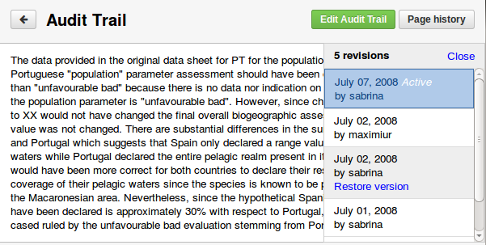
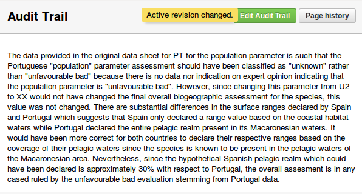

Data sheet info and Audit trail
===============================

Add/Edit data sheet info
------------------------

If there is no data sheet info record for the period, species/habitat name and
bio-region selected, the authenticated user can add a new data sheet info by
pressing *Edit Data Sheet info*.

.. figure:: images/add_new_dsi.png
   :alt: Add new data sheet info
   :width: 70%

   Add new data sheet info

A rich text editor appears on the page, giving the user the posibility to write
and format the data sheet info text.

.. figure:: images/edit_dsi.png
   :alt: Add new data sheet info form
   :width: 70%

   Add new data sheet info form

After pressing *Submit*, the new data sheet info becomes the active revision.
The operation can be interrupted using the *Cancel* button.

.. figure:: images/saved_dsi.png
   :alt: Active data sheet info
   :width: 70%

   Active data sheet info

An existing data sheet info record can be modified following the same steps.
Only the active data sheet info can be edited.

.. figure:: images/edit_dsi2.png
   :alt: Edit data sheet info
   :width: 70%

   Edit data sheet info

.. figure:: images/saved_dsi2.png
   :alt: Updated data sheet info
   :width: 70%

   Updated data sheet info

After successfully submitting the edited data sheet info, it becomes the active
revision. All the revisions can be seen by accessing the *Page History*.

.. figure:: images/page_history_dsi.png
   :alt: Page history
   :width: 70%

   Page history

Change active revision for data sheet info
------------------------------------------

Clicking the *Page history* button will open a popover containing a list of all
the data sheet versions for the current selection. Versions other than the
active one can be previewed by clicking the options in the versions list.

.. figure:: images/preview_revision.png
   :alt: Preview revision
   :width: 70%

   Preview revision

Following the *Restore version* link will replace the old active data sheet
info with the one selected from *Page history*.

.. figure:: images/change_revision.png
   :alt: Change revision
   :width: 70%

   Change revision

Comment on data sheet info
--------------------------

An authenticated user can add comments to a data sheet info record. The same
restriction as for conclusion comments is imposed: an user can add a single
comment for a selection (period, name, bio-region). Once the comment added, the
user can edit/delete/undelete it.
Comments are added by clicking the *Add comment* button, that exists on the
page only if a comment hasn't been previously added for that selection.
After filling in the comment textarea, the user is expected to *submit* the
comment or *cancel* the operation.

.. figure:: images/add_comment_dsi.png
   :alt: Add comment
   :width: 70%

   Add comment

A series of operations are permitted for data sheet info comments:

* owned comments:

    * edit
    * delete
    * undelete

* other users' comments:

    * mark as read
    * mark as unread

.. figure:: images/manage_comment_dsi.png
   :alt: Manage comments
   :width: 70%

   Manage comments

Add/Edit audit trail
--------------------

An audit trail record can be added only if a bio-region is selected. In a
selection for *All bioregions* where no audit trail record exists the following
warning message will be displayed.

.. figure:: images/all_bioreg_at.png
   :alt: No region selected warning
   :width: 70%

   No region selected warning

When a bio-region is selected, the *Edit Audit Trail* button is present on the
page.

.. figure:: images/add_at_button.png
   :alt: Add Audit Trail button
   :width: 70%

   Add Audit Trail button

To add an audit trail record, click the *Edit Audit Trail* button, which will
open the rich text editor that allows users to fill in and format the text.
The new audit trail record can be saved using the *Submit* button, or it can be
dismissed using the *Cancel* button.

The procedure for editing an existing audit trail record is very similar to the
one described above. Pressing the *Edit Audit Trail* button will allow users to
modify the existing content for their selection.

   Add/Edit Audit Trail form

In the case when the selected biogeographical region is *All bioregions*, all
the audit trails from any selectable biogeographical region for the currently
selected habitat or species are merged together in a common audit trail
page where each regional audit trail are be prefixed by the name of the
biogeographical region.

   Audit Trail merged page for all bioregions

From this merged view the user can navigate to the individual page of one of
the biogeographical regions, where he has the option to edit the audit trail,
view the page history and change the active revision. Returning to the merged
page is possible by pressing the *Back* button in the top-left corner.

   Audit Trail back button

Change active revision for audit trail
--------------------------------------

Clicking the *Page history* button will open a popover containing a list of all
the audit trail versions for the current selection. Versions other than the
active one can be previewed by clicking the options in the versions list.

   Preview revision

Following the *Restore version* link will replace the current active audit
trail with the one selected from *Page history*.

   Change revision
